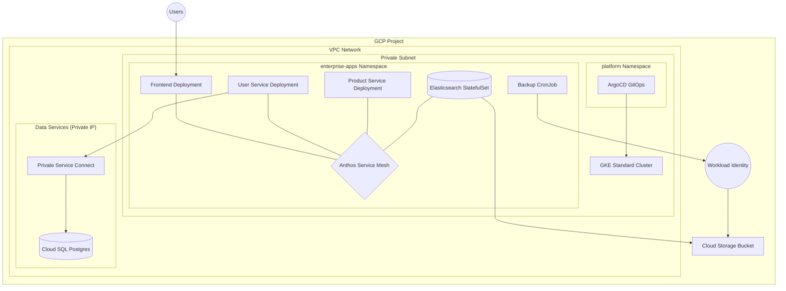

# Enterprise-Grade GKE & Cloud SQL Multi-Service Project

This project demonstrates a production-ready, end-to-end cloud-native architecture on Google Cloud Platform. It integrates foundational infrastructure management, advanced platform services, and a secure, stateful microservices stack.

## 🏛️ High-Level Architecture

The architecture is built on three pillars: Infrastructure as Code (IaC), Platform Security & Observability, and a Resilient Application Stack.

### 1. Infrastructure Layer (Terraform Managed)
*   **Networking:** Custom VPC with private subnets, Cloud NAT for outbound internet access, and Private Service Connect (PSC) for secure database communication.
*   **Compute:** A private **GKE Standard Cluster** with Workload Identity enabled, providing the necessary control for complex stateful workloads.
*   **Persistence:**
    *   **Cloud SQL (Postgres):** A highly available managed database instance.
    *   **Cloud Storage (GCS):** Designated buckets for persistent backups and snapshots.

### 2. Platform & Security Layer
*   **GitOps (ArgoCD):** Centralized deployment management. ArgoCD monitors the Git repository and automatically synchronizes the cluster state with the desired configuration.
*   **Service Mesh (Anthos Service Mesh):** Managed Istio provides:
    *   **Strict mTLS:** Automated encryption and identity for all service-to-service communication.
    *   **Traffic Management:** Canary deployments and advanced routing.
    *   **Observability:** Comprehensive logging and tracing within the mesh.
*   **Pod Security Admission (PSA):** Enforces the **Restricted** Pod Security Standard on application namespaces, ensuring all pods follow security best practices (non-root, no privilege escalation).

### 3. Application Stack (5 Tier Microservices)
The application is composed of five specialized services, demonstrating both stateless and stateful patterns:

1.  **Frontend (Stateless):** React/Nginx based web interface serving users.
2.  **User Service (Stateless):** Handles user data, connecting to Cloud SQL via the **Cloud SQL Auth Proxy** and **Workload Identity**.
3.  **Product Service (Stateless):** Manages the core product catalog and business logic.
4.  **Search Service (StatefulSet):** **Elasticsearch** cluster deployed with Persistent Volume Claims (PVCs) for data durability.
5.  **Backup/Admin Service (CronJob):** Performs automated data exports from Cloud SQL and snapshots from Elasticsearch, uploading them securely to GCS.

## 🛠️ Configuration Management
*   **Helm:** Used for deploying foundational platform components like ArgoCD and Elasticsearch operators.
*   **Kustomize:** Used for application deployments, providing clean environment-specific overlays (e.g., development vs. production) without duplicating YAML code.

## 🚀 Implementation Roadmap
*   **Phase 1:** Provision core infrastructure (VPC, GKE, Cloud SQL, GCS) via Terraform.
*   **Phase 2:** Bootstrap the cluster with ArgoCD and Anthos Service Mesh.
*   **Phase 3:** Configure the GitOps repository structure using Kustomize.
*   **Phase 4:** Deploy the microservices stack and verify connectivity and security policies.
*   **Phase 5:** Implement and test the automated backup/recovery workflow.

---

## 📂 Directory Structure

### 1. Infrastructure as Code (Terraform)
Located in `infrastructure/`:
*   `network.tf`: Custom VPC, private subnets, and Cloud NAT.
*   `gke.tf`: Private GKE Standard Cluster with Workload Identity.
*   `database.tf`: Highly available Cloud SQL (Postgres) with private IP.
*   `storage.tf`: GCS bucket for secure backups.
*   `iam.tf`: GCP Service Accounts and Workload Identity bindings.

### 2. Platform & Security
Located in `platform/`:
*   `namespaces.yaml`: Namespace definitions with ASM and PSA labels.
*   `argocd/`: Kustomize configuration to bootstrap ArgoCD.

### 3. Microservices Stack
Located in `services/`:
*   `base/kustomization.yaml`: Orchestrates the deployment of all services.
*   `base/search/elasticsearch.yaml`: Elasticsearch StatefulSet and Service.
*   `base/user/deployment.yaml`: User service with Cloud SQL Proxy sidecar.
*   `base/core-services.yaml`: Frontend and Product service deployments.
*   `base/backup/cronjob.yaml`: Automated backup job with GCS integration.
